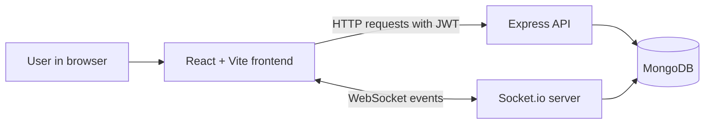

# Relay


Relay is a real-time chat room application built with React, Express, MongoDB, and Socket.io.

It lets people create rooms, join conversations, see who is online, send messages instantly, react with emojis, and return later to see message history.

## Why Relay Exists

Group chats are useful when people can move quickly without setup friction. Relay solves a simple problem: it gives a team or small community a shared place to talk in named rooms, while keeping messages persistent and the interface easy to understand.

Relay is not trying to be a full Slack replacement. It is a focused chat app that demonstrates a complete MERN-style real-time workflow:

- User accounts and login
- Protected chat rooms
- Live messages through WebSockets
- Persistent data in MongoDB
- A responsive React interface

## Features

| Area | What Relay Does |
| --- | --- |
| Authentication | Register, log in, verify saved sessions, and log out |
| Chat rooms | Create rooms, browse rooms, search rooms, join rooms, and leave rooms |
| Private rooms | Mark a room as private and require an access key before joining |
| Real-time chat | Send and receive messages instantly with Socket.io |
| Presence | See online members inside the active room |
| Typing status | Show when another user is typing |
| Reactions | Add, update, or remove emoji reactions on messages |
| History | Load recent messages when joining and fetch older messages in batches |
| Interface | Responsive layout with room sidebar, chat pane, member list, and light/dark theme |

<!-- ## Screenshots

No screenshots or GIFs are currently committed to this repository. When images are added, place them in a docs or assets folder and link them here.

Suggested captures:

| Screen | What to show |
| --- | --- |
| Login | Relay sign-in screen |
| Chat | Room list, message feed, typing state, and online members |
| Create room | Public/private room creation modal | -->

## Tech Stack

| Layer | Tools |
| --- | --- |
| Frontend | React 18, Vite, React Router, Axios, Socket.io Client |
| Backend | Node.js, Express, Socket.io |
| Database | MongoDB with Mongoose |
| Auth | JSON Web Tokens and bcryptjs |
| Styling | Plain CSS with CSS variables |
| Deployment config | Vercel SPA rewrite for the frontend |

## Architecture

Relay is split into two applications:

- `chat-app-frontend`: the React single-page app users interact with.
- `chat-app-backend`: the API server, Socket.io server, and MongoDB connection.



### How the Main Flow Works

1. A user registers or logs in.
2. The backend checks the credentials and returns a JWT.
3. The frontend stores the token in `localStorage`.
4. Axios attaches the token to protected API requests.
5. After login, the frontend opens a Socket.io connection.
6. When the user selects a room, the socket joins that room channel.
7. Messages, reactions, typing state, and online users are synced in real time.
8. Messages are saved in MongoDB so room history is available later.

## Authentication

Relay uses token-based authentication.

- Passwords are hashed with `bcryptjs` before they are saved.
- Login accepts either username or email.
- The backend signs JWTs with `JWT_SECRET`.
- Tokens expire after 7 days.
- Protected routes require an `Authorization: Bearer <token>` header.
- On app load, the frontend calls `/api/auth/verify` to restore a saved session.

The frontend stores the token in `localStorage`. This keeps the demo simple, but production apps may prefer httpOnly cookies depending on the threat model.

## Real-Time Messaging

Relay uses Socket.io for live chat behavior.

When a user joins a room, the server:

- Adds the socket to the room channel.
- Tracks that user in an in-memory online user list.
- Sends the last 50 messages to the joining user.
- Broadcasts updated online users to everyone in the room.

When a user sends a message, the server:

- Trims and validates the message.
- Saves it to MongoDB.
- Emits it to every connected client in that room.

Reactions are also persisted. A user can add one reaction, switch it to another emoji, or click the same emoji again to remove it.

## Project Structure

```text
Relay/
|-- chat-app-backend/
|   |-- middleware/
|   |   `-- auth.js
|   |-- models/
|   |   |-- Message.js
|   |   |-- Room.js
|   |   `-- User.js
|   |-- routes/
|   |   |-- auth.js
|   |   `-- rooms.js
|   |-- socket/
|   |   `-- socketHandler.js
|   |-- .env.example
|   |-- package.json
|   `-- server.js
|-- chat-app-frontend/
|   |-- public/
|   |   `-- manifest.json
|   |-- src/
|   |   |-- components/
|   |   |   |-- Auth/
|   |   |   |-- Chat/
|   |   |   `-- Sidebar/
|   |   |-- context/
|   |   |   |-- AuthContext.jsx
|   |   |   `-- SocketContext.jsx
|   |   |-- styles/
|   |   |   `-- app.css
|   |   |-- utils/
|   |   |   `-- api.js
|   |   |-- App.jsx
|   |   `-- index.jsx
|   |-- .env.example
|   |-- package.json
|   |-- vercel.json
|   `-- vite.config.js
|-- .gitignore
`-- README.md
```

## Getting Started

### Prerequisites

Install these before running Relay:

- Node.js
- npm
- MongoDB running locally, or a MongoDB Atlas connection string

### 1. Clone the Repository

```bash
git clone <repository-url>
cd Relay
```

### 2. Configure the Backend

```bash
cd chat-app-backend
npm install
cp .env.example .env
```

Edit `chat-app-backend/.env`:

```env
PORT=5080
MONGO_URI=mongodb://localhost:27017/relay
JWT_SECRET=replace_with_a_long_random_secret
CLIENT_URL=http://localhost:3000
```

| Variable | Required | Purpose |
| --- | --- | --- |
| `PORT` | No | Backend port. The example uses `5080`. |
| `MONGO_URI` | Yes | MongoDB connection string. |
| `JWT_SECRET` | Yes | Secret used to sign and verify JWTs. |
| `CLIENT_URL` | Recommended | Allowed frontend origin for CORS. Supports comma-separated origins. |

Start the backend:

```bash
npm run dev
```

### 3. Configure the Frontend

Open another terminal:

```bash
cd chat-app-frontend
npm install
cp .env.example .env
```

Edit `chat-app-frontend/.env`:

```env
VITE_API_URL=http://localhost:5080
VITE_APP_SOCKET_URL=http://localhost:5080
```

| Variable | Required | Purpose |
| --- | --- | --- |
| `VITE_API_URL` | Recommended | Backend URL used by Axios and the Vite dev proxy. |
| `VITE_APP_SOCKET_URL` | Optional | Socket.io server URL. If omitted, the frontend uses the current browser origin. |

Start the frontend:

```bash
npm start
```

Open:

```text
http://localhost:3000
```

## Usage

1. Create an account with a username, email, and password.
2. Create a room from the sidebar.
3. Choose whether the room is public or private.
4. If the room is private, share the access key with people who should join.
5. Select a room and send messages.
6. Hover over messages to react with emojis.
7. Use "Load earlier messages" to fetch older history.
8. Use the theme button to switch between light and dark mode.

## API Overview

All protected endpoints require:

```http
Authorization: Bearer <jwt>
```

### Auth Routes

| Method | Route | Access | Description |
| --- | --- | --- | --- |
| `POST` | `/api/auth/register` | Public | Create a user and return a token |
| `POST` | `/api/auth/login` | Public | Log in with username/email and password |
| `GET` | `/api/auth/verify` | Private | Verify the current token and return the user |

### Room Routes

| Method | Route | Access | Description |
| --- | --- | --- | --- |
| `POST` | `/api/rooms` | Private | Create a public or private room |
| `GET` | `/api/rooms` | Private | List all rooms |
| `GET` | `/api/rooms/:id` | Private | Get one room |
| `POST` | `/api/rooms/:id/join` | Private | Join a room, with an access key if required |
| `POST` | `/api/rooms/:id/leave` | Private | Leave a room |
| `GET` | `/api/rooms/:id/messages` | Private | Get messages, with optional `before` and `limit` query params |

## Socket Events

### Client to Server

| Event | Payload | Purpose |
| --- | --- | --- |
| `joinRoom` | `{ roomId, username, userId }` | Join a Socket.io room and load recent history |
| `chatMessage` | `{ roomId, userId, username, message }` | Send a text message |
| `typing` | `{ roomId, username, isTyping }` | Notify others that the user is typing or stopped typing |
| `messageReaction` | `{ roomId, messageId, username, reaction }` | Add, change, or remove a reaction |
| `leaveRoom` | `{ roomId, username }` | Leave the active socket room |

### Server to Client

| Event | Payload | Purpose |
| --- | --- | --- |
| `loadHistory` | `Message[]` | Send the latest room messages to a joining user |
| `message` | `Message` | Broadcast a new message |
| `onlineUsers` | `User[]` | Broadcast active users in the room |
| `userJoined` | `{ username, message }` | Notify room members that someone joined |
| `userLeftChat` | `{ userId, username, message }` | Notify room members that someone explicitly left |
| `typing` | `{ username, isTyping }` | Show typing state |
| `reactionUpdate` | `{ messageId, reactions }` | Update reactions for a message |
| `roomCreated` | `Room` | Add newly created rooms to connected clients |

## Security Notes

Relay includes several practical security basics:

- Passwords are never stored in plain text.
- Private room access keys are hashed before storage.
- Backend startup fails if `MONGO_URI` or `JWT_SECRET` is missing.
- API routes use JWT middleware for protected actions.
- CORS is restricted to configured frontend origins.
- Real credentials are excluded by `.gitignore`.

Important production hardening still to consider:

- Add rate limiting for login, registration, and message sending.
- Validate and sanitize request bodies more strictly.
- Authenticate Socket.io connections on the server.
- Add refresh-token or cookie-based session handling if needed.
- Add automated tests for auth, rooms, and socket behavior.
- Add logging and monitoring for production deployments.

## Data Models

| Model | Stores |
| --- | --- |
| `User` | Username, email, hashed password, creation date |
| `Room` | Name, description, creator, members, privacy flag, hashed access key |
| `Message` | Room, sender, sender username, content, type, reactions, timestamp |

Messages are indexed by room and timestamp so older room history can be fetched efficiently.

## Deployment Notes

The frontend includes a `vercel.json` rewrite so React Router routes work after deployment.

For deployment, set environment variables in your hosting provider:

- Backend: `MONGO_URI`, `JWT_SECRET`, `CLIENT_URL`, and optionally `PORT`
- Frontend: `VITE_API_URL` and, if needed, `VITE_APP_SOCKET_URL`

Make sure the backend CORS `CLIENT_URL` matches the deployed frontend URL.

## Future Improvements

- Server-side Socket.io authentication
- Unit and integration tests
- Better request validation
- Rate limiting and abuse protection
- Room ownership and moderation tools
- Message editing and deletion
- Unread counts and notifications
- File or image messages
- Deployment guide with screenshots

## License

No license file is currently included in this repository.
